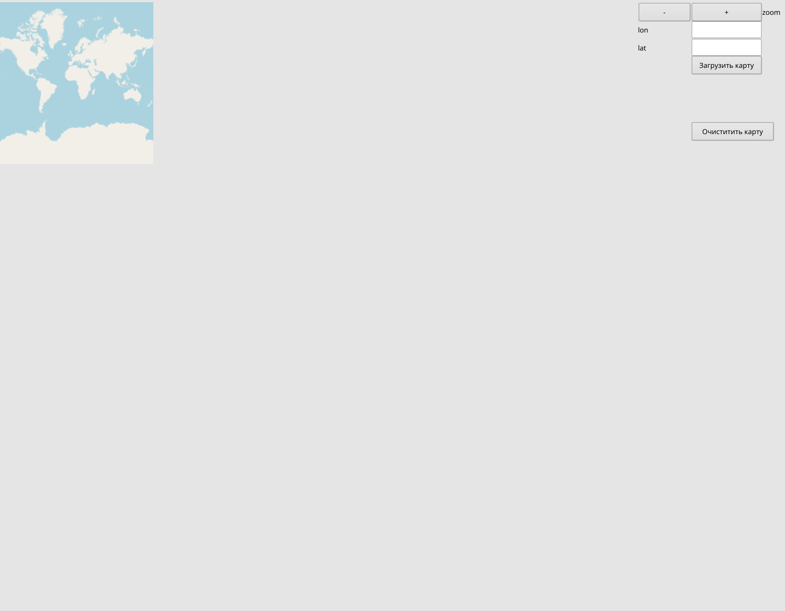
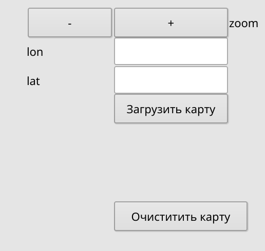
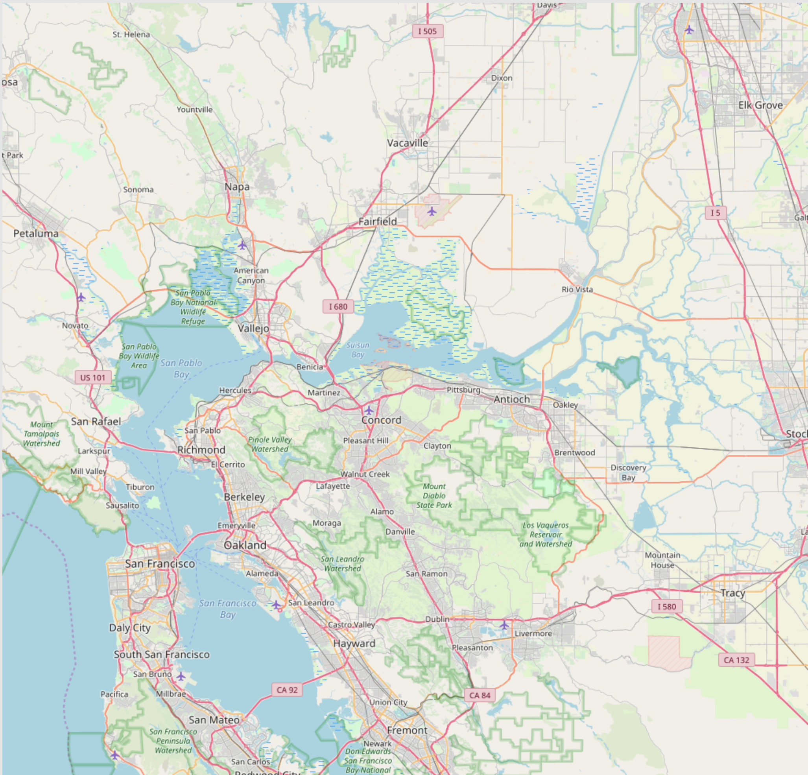
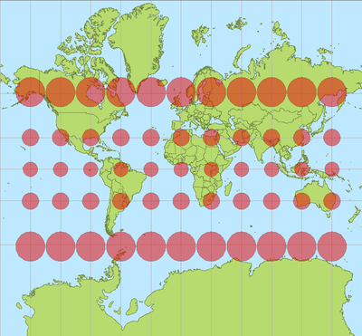

# TileCheckerFromOSMServer

Это графическое приложение, созданое для воспроизведения тайлов [OpenStreetMapDockerServer'а](https://github.com/Overv/openstreetmap-tile-server).

# Принцип работы программы

1\. Создаётся GUI-интерфейс, включающий в себя:

а. виджеты для отображения тайлов

б. виджеты для отображения текстов

в. кнопка `zoom`

г. виджеты для ввода долготы и текста

д. Кнопки `Загрузить Карту` и `Очистить Карту`

2\. Вводим значения долготы и широты в окошко и нажимаем `Загрузить Карту`. Тут стоит отметить, чтобы карта загрузилась необходимо включить [OpenStreetMapDockerServer](https://github.com/Overv/openstreetmap-tile-server).

3\. Загрузка карты происходит одноразово, после этого можно приближать и отдалять её с помощью кнопок `+` и `-` меню `zoom` без дополнительной загрузки.

4\. C помощью кнопки `Очистить карту` удаляются все изображения скачанные с сервера, и для работы приложения необходимо загрузить карту заново.

5\. С помощью кнопки `Q` - приложение заканчивает свою работу

# Расчёт расстояния на пиксель взависимости от Уровня приближения(Zoom)

Горизонтальное расстояние, отображаемое каждым квадратным тайлом вдоль параллели на заданной широте вычисляется как:

`S.tile = C * cos(latitude)/2^zoomlevel` , где `С` означает экваториальную окружность Земли (40 075 016,686 м = 2п *6 378 137,000 м для эталонного геоида, используемого OpenStreetMap).

Так как тайлы имеют ширину в 256 пикселов, расстояние отображаемое одним пикселом (S) вычисляется, как:

`S.pixel = S.tile / 256 = C * cos(latitude) / 2^(zoomlevel+8)`

Например, на экваторе и уровне увеличения 0, для метров: 40 075 016.6 / 256 ~= 6 378 137.0 * 2 * П/ 256 ~= 156 543.03

Необходимо убедиться, что калькулятор находится в режиме работе с градусами, если вы хотите указать широту в градуса, а не радианах. `C` должна быть выражена в единице измерения, которую мы считаем(мили,метры,футы и т.д).

Из-за того, что на самом деле Земля эллиптическая, возможно незначительная ошибка в вычислениях, максимум 0.3%

## Разрешение и масштаб

Точная длина экватора (согласно Википедии) составляет 40075,016686 км в WGS-84. При увеличении 0 один пиксель будет равен 156543,03 метра (при условии размера плитки 256 пикселей):
`40075.016686 * 1000 / 256 ≈ 6378137.0 * 2 * pi / 256 ≈ 156543.03`

Что дает нам формулу для расчета разрешения при любом заданном увеличении:
`resolution = 156543.03 meters/pixel * cos(latitude) / (2 ^ zoomlevel)`

Некоторым приложениям необходимо знать масштаб карты, то есть как 1 см на экране преобразуется в 1 см карты.
`scale = 1 : (screen_dpi * 1/0.0254 in/m * resolution)`

И вот таблица, которая избавит вас от этих вычислений. Все значения показаны для экватора, и вы должны умножить их на cos (широту), чтобы приспособиться к заданной широте. Например, разделите их на 2 для 60-й широты (Осло, Хельсинки, Санкт-Петербург).

| Zoom | Resolution, m/pixel | scale 90 dpi  | 1 screen cm is | scale 96 dpi  | scale1 20 dpi |
|------|---------------------|---------------|----------------|---------------|---------------|
| 0    | 156543.03           | 1:554 680 041 | 5547 km        | 1:591 658 771 | 1:739 573 378 |
| 1    | 78271.52            | 1:277 340 021 | 2773 km        | 1:295 829 335 | 1:369 786 694 |
| 2    | 39135.76            | 1:138 670 010 | 1387 km        | 1:147 914 678 | 1:184 893 347 |
| 3    | 19567.88            | 1:69 335 005  | 693 km         | 1:73 957 339  | 1:92 446 674  |
| 4    | 9783.94             | 1:34 667 503  | 347 km         | 1:36 978 669  | 1:46 223 337  |
| 5    | 4891.97             | 1:17 333 751  | 173 km         | 1:18 489 335  | 1:23 111 668  |
| 6    | 2445.98             | 1:8 666 876   | 86.7 km        | 1:9 244 667   | 1:11 555 834  |
| 7    | 1222.99             | 1:4 333 438   | 43.3 km        | 1:4 622 334   | 1:5 777 917   |
| 8    | 611.50              | 1:2 166 719   | 21.7 km        | 1:2 311 167   | 1:2 888 959   |
| 9    | 305.75              | 1:1 083 359   | 10.8 km        | 1:1 155 583   | 1:1 444 479   |
| 10   | 152.87              | 1:541 680     | 5.4 km         | 1:577 792     | 1:722 240     |
| 11   | 76.437              | 1:270 840     | 2.7 km         | 1:288 896     | 1:361 120     |
| 12   | 38.219              | 1:135 420     | 1.35 km        | 1:144 448     | 1:180 560     |
| 13   | 19.109              | 1:67 710      | 677 m          | 1:72 224      | 1:90 280      |
| 14   | 9.5546              | 1:33 855      | 339 m          | 1:36 112      | 1:45 140      |
| 15   | 4.7773              | 1:16 927      | 169 m          | 1:18 056      | 1:22 570      |
| 16   | 2.3887              | 1:8 464       | 84.6 m         | 1:9 028       | 1:11 285      |
| 17   | 1.1943              | 1:4 232       | 42.3 m         | 1:4 514       | 1:5 642       |
| 18   | 0.5972              | 1:2 116       | 21.2 m         | 1:2 257       | 1:2 821       |

### Расстояния в градусах долготы для широт, отмеченных на рисунке.

| Разница долгот | at 0° lat. | at 30° lat. | at 60° lat. | at 87.5° lat. |
|----------------|------------|-------------|-------------|---------------|
| 0.01    °      | ~ 1 000 m  | ~ 870    m  | ~ 500   m   | ~ 43.62    m  |
| 0.001   °      | ~   100 m  | ~  87    m  | ~  50   m   | ~  4.36    m  |
| 0.0001  °      | ~    10 m  | ~   8.7  m  | ~   5   m   | ~   0.44   m  |
| 0.00001 °      | ~     1 m  | ~   0.87 m  | ~   0.5 m   | ~    0.04  m  |

